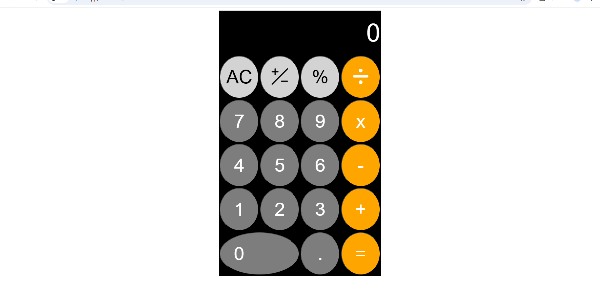
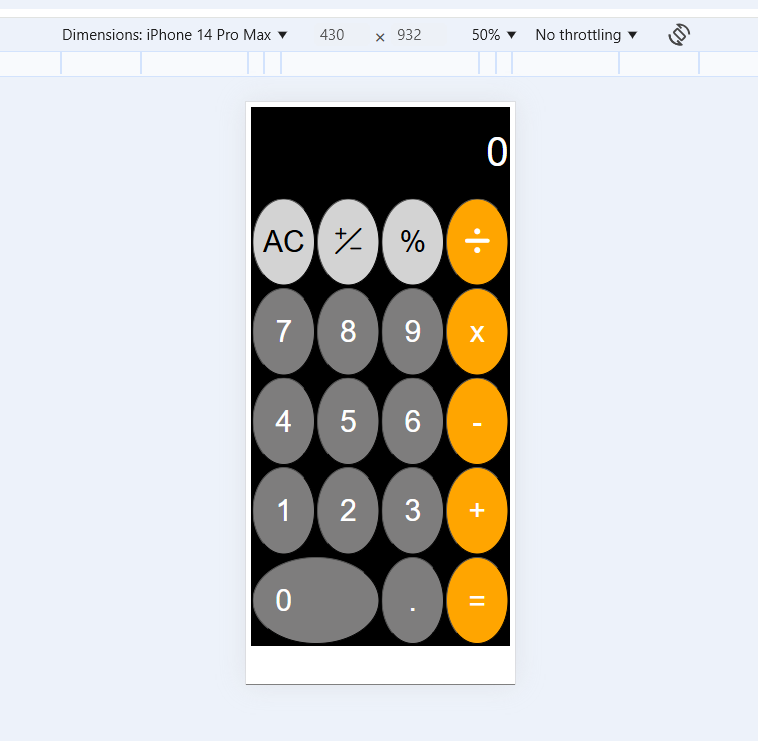

## Link
https://calculator411.w3spaces.com
# Calculator

A **simple and responsive calculator** built using HTML, CSS, and JavaScript. This project supports essential arithmetic operations and includes a visually appealing, user-friendly design.

## Features

- **Basic Arithmetic Operations**: Addition, Subtraction, Multiplication, Division, and Percentage.
- **Responsive Design**: Adjusts seamlessly for different screen sizes (mobile and desktop).
- **Elegant UI**:
  - Buttons with distinct color coding for numbers, operators, and clear functions.
  - Stylish icons for operations like division and change sign.
- **Keyboard-Free Input**: Operate entirely using on-screen buttons.
- **Real-Time Evaluations**: Supports continuous calculations by maintaining the expression state.
- **Custom Behavior**:
  - Change the sign of a number.
  - Limit the input to 11 characters for better UX.

## Technologies Used

- **HTML**: For structuring the calculator's layout.
- **CSS**: For styling and responsive design.
- **JavaScript**: For dynamic behavior and calculations.
- **Libraries**:
  - [Font Awesome](https://cdnjs.com/libraries/font-awesome): For stylish icons.
  - [Bootstrap Icons](https://icons.getbootstrap.com/#install): For additional visual elements.

## Screenshots

### Desktop View


### Mobile View


## How to Use

1. Clone the repository:
   ```bash
   git clone https://github.com/your-username/calculator.git
2. Open the `index.html` file in your favorite browser.

## File Structure

```plaintext
calculator/
├── index.html       # Main HTML file
├── index.css        # CSS file for styling
├── index.js         # JavaScript file for logic
└── README.md        # Project description
```

## Code Highlights

### Responsive Table Design

The table adjusts its width dynamically using media queries:

```css
@media (max-width:480px) {
    table {
        width: 100%;
    }
}
@media (min-width: 480px) {
    table {
        width: 416px;
    }
}
```

### Custom Evaluation Logic

Supports real-time arithmetic evaluations using a stack-based approach:

```javascript
function myEval(exp) {
    let numbers = [];
    let operators = [];
    // Parsing and evaluating the expression
}
```

## Future Enhancements

- Add keyboard input support.
- Include scientific functions (e.g., square root, trigonometry).
- Implement a dark/light mode toggle.

## License

This project is licensed under the [MIT License](LICENSE).

## Acknowledgements

- [Font Awesome](https://fontawesome.com/)
- [Bootstrap Icons](https://getbootstrap.com/)
- [Math.js](https://mathjs.org/)

---

Feel free to contribute to this project by submitting issues or pull requests!

### Steps to Follow:
1. Replace `your-username` with your GitHub username in the cloning command.
2. Add screenshots named `screenshot-desktop.png` and `screenshot-mobile.png` to your repository.
3. Create a `LICENSE` file if you decide to license the project under MIT or another license.
